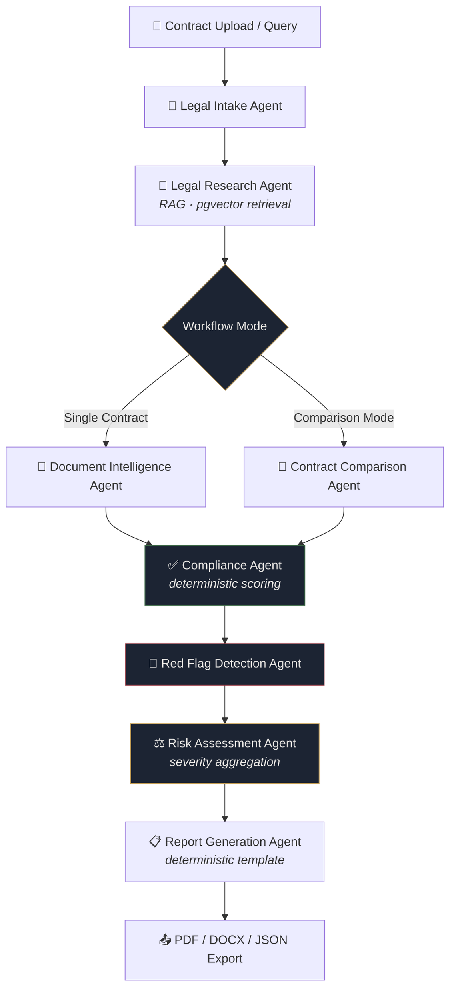

# ⚖️ Legal Intelligence Platform

**A production-grade, multi-agent AI system that reads contracts like a legal investigator — extracting evidence, scoring compliance, flagging risk, and generating audit-ready reports.**

[](https://www.python.org/)
[](https://fastapi.tiangolo.com/)
[](https://www.langchain.com/langgraph)
[](https://www.langchain.com/)
[](https://github.com/pgvector/pgvector)
[](https://groq.com/)
[](https://streamlit.io/)
[](#)

---

## 🧭 Overview

Legal Intelligence Platform is a **9-agent LangGraph pipeline** that transforms raw contract PDFs into structured, evidence-backed legal intelligence — clause extraction, compliance scoring, red-flag detection, risk aggregation, and side-by-side contract comparison, all grounded in a RAG pipeline over PostgreSQL/pgvector.

It's built to demonstrate the core skills a GenAI engineering role actually requires: agent orchestration with real conditional routing, retrieval-augmented generation, deterministic-vs-LLM design tradeoffs, and a FastAPI backend that doesn't fall over on malformed model output.

---

## ✨ Feature Highlights

- 🧩 **Multi-agent LangGraph workflow** with real conditional routing (single-contract vs. contract-comparison branches)
- 📄 **Deep document intelligence** — parties, dates, obligations, payment terms, and clause-level extraction with evidence citations
- ✅ **Deterministic compliance scoring** (0–100, computed in Python, never hallucinated) against a mandatory-clause checklist
- 🚩 **Red flag detection** — unlimited liability, one-sided termination, excessive penalties, and more, each with an evidence trail
- ⚖️ **Aggregated risk scoring** — one overall risk level computed from every severity signal in the pipeline
- 🔀 **Contract comparison** — GitHub-diff-style redline of added/removed/modified clauses between two contracts
- 🔎 **RAG-grounded legal research** over a pgvector-backed statute/regulation/clause-reference corpus
- 📤 **PDF / DOCX / JSON export** — branded, paginated case reports generated with ReportLab and python-docx
- 🖥️ **Custom enterprise UI** — a full-width "Legal Investigation Command Room" theme, not a default Streamlit dashboard

---

## 🏗️ Architecture



**Design decisions worth noting:**
- Routing after the Research Agent is a genuine `add_conditional_edges` branch on `workflow_mode`, not a linear pipeline dressed up as one.
- The **Report Generation Agent is deterministic** — it renders from structured state via Python templates, not another LLM call, so report structure is 100% reliable.
- **Compliance scoring is pure Python**, computed from clause-presence flags — the LLM only supplies narrative explanations, never the score itself.

---

## 🤖 The Multi-Agent Workflow

| # | Agent | Responsibility |
|---|-------|-----------------|
| 1 | **Legal Intake Agent** | Classifies the request (Contract Review, Legal Research, Clause Explanation, Risk Analysis) |
| 2 | **Legal Research Agent** | RAG retrieval over pgvector — statutes, regulations, clause references, and relevant document chunks |
| 3 | **Document Intelligence Agent** | Extracts parties, dates, obligations, payment terms, and confidentiality/liability/indemnity/termination clauses — each with evidence |
| 4 | **Compliance Agent** | Deterministic 0–100 compliance score + missing-clause detection against a mandatory checklist |
| 5 | **Red Flag Detection Agent** | Detects named risk patterns (unlimited liability, one-sided termination, broad indemnification, etc.) with explanations |
| 6 | **Risk Assessment Agent** | Aggregates every severity signal in the pipeline into one overall risk level |
| 7 | **Report Generation Agent** | Assembles the final evidence-backed report via deterministic Python templates |
| 8 | **Contract Comparison Agent** | Diffs two contracts — added, removed, and modified clauses — in comparison mode |

All nine responsibilities above map onto eight agent modules — RAG retrieval (traditionally a standalone "Retrieval Agent") is implemented as a capability *of* the Legal Research Agent rather than a separate node, since it's a single retrieval call, not an independent decision-making step.

---

## 🧰 Tech Stack

| Layer | Technology |
|---|---|
| **Orchestration** | LangGraph (`StateGraph` + conditional routing), LangChain Core |
| **LLM** | Groq — Llama 3.3 70B Versatile |
| **Backend** | FastAPI, Pydantic, SQLAlchemy |
| **Database** | PostgreSQL + pgvector (cosine similarity search) |
| **Embeddings** | Sentence Transformers (`all-MiniLM-L6-v2`, local, no paid API) |
| **Frontend** | Streamlit + Plotly (custom dark "Command Room" theme) |
| **Document Export** | ReportLab (PDF), python-docx (DOCX) |
| **Testing** | Pytest (38 tests — agent logic, defensive parsing, LangGraph routing) |
| **Deployment** | Render (native Python runtime) |

---

## 📁 Project Structure
legal-intelligence-platform/
├── backend/
│ ├── app/
│ │ ├── agents/ # 8 agent modules + shared LangGraph state schema
│ │ ├── rag/ # PDF processing, chunking, embeddings, retrieval
│ │ ├── routes/ # FastAPI endpoints (analyze, compare, compliance, risk, downloads...)
│ │ ├── utils/ # Prompts, report templates, PDF/DOCX generators
│ │ ├── graph.py # LangGraph workflow assembly
│ │ └── main.py # FastAPI entrypoint
│ ├── tests/ # 38 pytest tests
│ └── requirements.txt
├── database/
│ ├── schema.sql # PostgreSQL + pgvector schema
│ └── migrations/
├── frontend/
│ ├── pages/ # 6-page Streamlit app
│ ├── theme.py # Custom design system
│ └── components.py
└── README.md

---

## 🖼️ Screenshots

| Contract Analysis | Compliance Dashboard | Risk Dashboard |
|---|---|---|
| _add screenshot_ | _add screenshot_ | _add screenshot_ |

| Contract Comparison (Redline) | Report Viewer / Export |
|---|---|
| _add screenshot_ | _add screenshot_ |

---

## ⚙️ Installation

```bash
git clone https://github.com/<your-username>/legal-intelligence-platform.git
cd legal-intelligence-platform
```

**Requirements:** Python 3.11+, PostgreSQL 15+ with `pgvector`, a free [Groq API key](https://console.groq.com).

---

## 🚀 Local Setup

**1. Database**
```bash
psql -U your_user -d your_db -f database/schema.sql
```

**2. Backend**
```bash
cd backend
python -m venv venv && source venv/bin/activate
pip install -r requirements.txt
cp .env.example .env   # set DATABASE_URL and GROQ_API_KEY
uvicorn app.main:app --reload
```

**3. Frontend**
```bash
cd frontend
pip install -r requirements.txt
export BACKEND_API_URL=http://localhost:8000
streamlit run streamlit_app.py
```

Backend → `http://localhost:8000/docs` · Frontend → `http://localhost:8501`

---

## ☁️ Deployment (Render)

1. Push to GitHub.
2. Create a Render **PostgreSQL** instance, apply `database/schema.sql`.
3. Deploy `backend/` as a Render **Web Service** — Python 3 runtime, start command `uvicorn app.main:app --host 0.0.0.0 --port $PORT`.
4. Deploy `frontend/` as a second Web Service — start command `streamlit run streamlit_app.py --server.port $PORT --server.address 0.0.0.0`.
5. Set `CORS_ORIGINS` on the backend to the frontend's Render URL.

---

## 🔮 Future Improvements

- LLM-driven supervisor agent for dynamic (not rule-based) routing
- Multi-jurisdiction compliance checklists
- Human-in-the-loop review before final report sign-off
- Session memory across multi-turn contract negotiations
- Async agent execution for latency reduction on long contracts

---

## 👤 Author

**[Your Name]**
AI/GenAI Engineer · [LinkedIn](#) · [Portfolio](#) · [GitHub](#)

---

## ⚠️ Disclaimer

This platform produces AI-generated analysis for informational and educational purposes only. It is **not a substitute for professional legal advice**. All risk and compliance findings are evidence-backed observations, not legal conclusions — always consult a licensed attorney before acting on contract terms.
